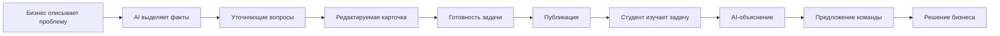
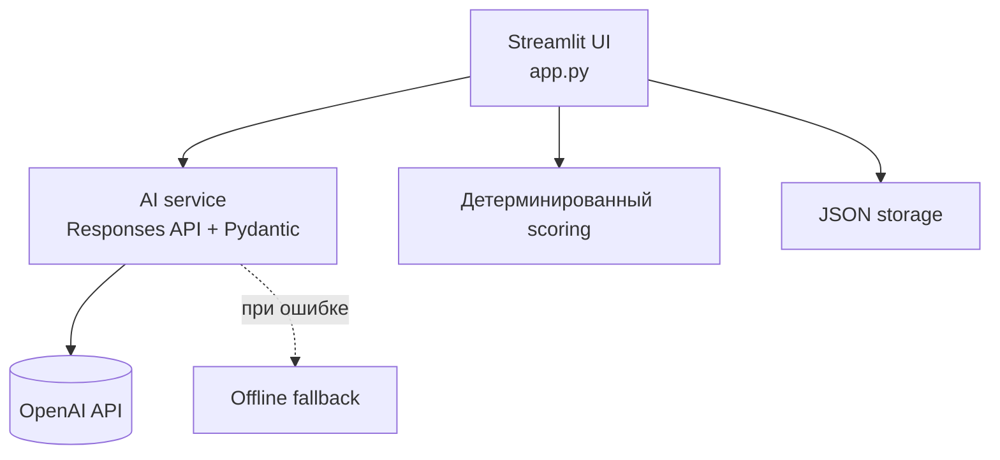

# Bridge

**Из реальной бизнес-проблемы — в понятную задачу для студентов.**

[](https://www.python.org/)
[](https://streamlit.io/)
[](https://developers.openai.com/api/docs/)
[](https://github.com/BAITC-Hacks/hack-055deb5f-diligence/actions/workflows/ci.yml)

Bridge — хакатонный MVP-проект, который помогает компаниям превращать размытые
бизнес-проблемы в понятные практические задачи, а студентам — быстро разбираться
в контексте и предлагать решения.

> AI помогает задавать вопросы, структурировать и объяснять информацию. Решение
> о публикации задачи и выборе команды всегда принимает человек.

[Быстрый запуск](#быстрый-запуск) · [Сценарий демонстрации](docs/DEMO_SCRIPT.md) · [Архитектура](#архитектура) · [Тесты](#проверка-проекта)

## Проблема

Бизнес часто формулирует задачи слишком общо: без доступных данных, ожидаемого
результата, ограничений и критериев успеха. Студентам приходится тратить время
на догадки и долгие уточнения вместо работы над решением.

Bridge создаёт единый прозрачный процесс от сырого описания проблемы до выбора
команды.

## Что умеет платформа

| Для бизнеса | Для студентов |
|---|---|
| Анализирует свободное описание проблемы | Показывает раздел «Найти задачу» |
| Задаёт до пяти уточняющих вопросов | Объясняет задачу под выбранный профиль |
| Формирует редактируемую карточку | Предлагает понятные первые шаги |
| Показывает объяснимую готовность 0–100 | Принимает идею и план решения команды |
| Показывает задачу студентам | Хранит историю отправленных предложений |
| Позволяет выбрать команду или отклонить предложение | Показывает статус рассмотрения |

Если OpenAI временно недоступен, основной сценарий продолжает работать в
демонстрационном fallback-режиме.

AI-объяснение задачи поддерживает профили `Новичок`, `AI / Data`, `Business`,
`Engineering`, `Design / Product` и три режима: коротко, с примерами и технически
подробно. Объяснение не меняет исходные требования компании.

## Как это работает



### Роль «Бизнес»

1. Описывает проблему обычными словами.
2. Отвечает на вопросы о данных, результате, пользователях и ограничениях.
3. Проверяет и при необходимости исправляет сформированную карточку.
4. Публикует задачу для студентов.
5. Рассматривает предложения команд и меняет их статус.

### Роль «Студент»

1. Выбирает задачу в разделе «Найти задачу».
2. Получает объяснение под свой профиль и нужную глубину.
3. Заполняет данные команды, идею и короткий план.
4. Отправляет предложение и отслеживает его статус.

## Готовность задачи

Показатель рассчитывает обычный Python-код — AI не может увеличить или уменьшить
баллы. Поле засчитывается, если содержит не менее 10 значимых символов.

| Поле карточки | Баллы |
|---|---:|
| Контекст и потребность | 20 |
| Данные и материалы | 20 |
| Ожидаемый результат | 15 |
| Критерии успеха | 15 |
| Ограничения | 10 |
| Пользователи | 10 |
| Контакт с бизнесом | 10 |
| **Итого** | **100** |

Уровни: `0–39` — Нужно уточнить, `40–69` — Можно брать в работу,
`70–89` — Хорошо подготовлена, `90–100` — Полностью готова. Низкая готовность
не блокирует публикацию, а показывает,
каких сведений не хватает.

## Технологии

| Компонент | Использование |
|---|---|
| Python 3.11+ | основная логика приложения |
| Streamlit 1.57 | интерфейс и сервер приложения |
| OpenAI Python SDK 3.19 | работа с Responses API |
| `gpt-5.6-luna` | модель по умолчанию, настраивается через `.env` |
| Pydantic 2.13 | проверка Structured Outputs от AI |
| python-dotenv 1.2 | локальная загрузка настроек и API-ключа |
| JSON | локальное хранение задач, команд и предложений |
| GitHub Actions | автоматический запуск тестов |

## Архитектура



- **Streamlit** объединяет интерфейс и серверную логику.
- **OpenAI Responses API** анализирует черновик, создаёт карточку и объясняет
  опубликованную задачу.
- **Pydantic Structured Outputs** проверяет структуру AI-ответов.
- **Python scoring** независимо и прозрачно рассчитывает готовность задачи.
- **JSON storage** хранит задачи, команды и предложения без отдельной БД.
- **Fallback** сохраняет демонстрационный сценарий без интернета и API-ключа.

## Данные и интеграции

- `data/tasks.json` содержит опубликованные задачи и их готовность.
- `data/teams.json` содержит демонстрационные профили команд.
- `data/proposals.json` содержит предложения команд и их статусы.
- OpenAI Responses API получает только поля карточки, необходимые для анализа,
  формирования или объяснения задачи.
- Внешние датасеты и сторонние API, кроме OpenAI, в текущей версии не используются.
- API-ключ хранится только в `.env` или в secrets окружения и не входит в Git.

## Структура проекта

```text
.
├── app.py                     # интерфейс и пользовательские сценарии
├── services/
│   ├── openai_service.py      # OpenAI, схемы и безопасная обработка ошибок
│   └── fallback.py            # автономный демонстрационный режим
├── utils/
│   ├── scoring.py             # готовность задачи 0–100
│   └── storage.py             # безопасное чтение и запись JSON
├── data/
│   ├── tasks.json             # задачи
│   ├── teams.json             # команды
│   └── proposals.json         # предложения решений
├── tests/                     # автоматические тесты
├── docs/DEMO_SCRIPT.md        # сценарий защиты проекта
├── requirements.txt
└── .env.example
```

## Быстрый запуск

Нужен Python 3.11 или новее.

### Windows PowerShell

```powershell
python -m venv .venv
.\.venv\Scripts\Activate.ps1
python -m pip install -r requirements.txt
Copy-Item .env.example .env
python -m streamlit run app.py
```

### macOS / Linux

```bash
python3 -m venv .venv
source .venv/bin/activate
python -m pip install -r requirements.txt
cp .env.example .env
python -m streamlit run app.py
```

После запуска откройте адрес из терминала, обычно
[`http://localhost:8501`](http://localhost:8501).

## Настройка OpenAI

В локальном `.env` укажите:

```dotenv
OPENAI_API_KEY=sk-your-key
OPENAI_MODEL=gpt-5.6-luna
```

`.env` исключён из Git. Настоящий ключ нельзя добавлять в `.env.example`,
README, исходный код, issue или сообщение коммита. Без ключа приложение
автоматически использует fallback-режим.

## Проверка проекта

```powershell
python -m unittest discover -s tests -v
python -m compileall -q app.py services utils
```

GitHub Actions автоматически запускает эти проверки для каждого push и pull
request в `main`.

### Сценарий, который может повторить жюри

1. Запустить приложение и выбрать роль **Компания**.
2. Открыть **Создать задачу** и нажать **Подставить пример**.
3. Попросить AI сформулировать задачу, ответить на вопросы и проверить карточку.
4. Показать задачу студентам.
5. Переключиться на роль **Студент**, открыть задачу и запросить объяснение.
6. Отправить предложение команды.
7. Вернуться к роли компании и выбрать команду в разделе **Предложения команд**.

Подробный двухминутный сценарий находится в
[`docs/DEMO_SCRIPT.md`](docs/DEMO_SCRIPT.md).

## Безопасность и ограничения MVP

- Модель получает инструкцию использовать только факты пользователя.
- Все AI-ответы проходят проверку схемой Pydantic.
- Бизнес вручную подтверждает карточку перед публикацией.
- API-ключ не записывается в JSON и не отправляется в Git.
- Ошибки API не показывают пользователю stack trace.
- Данные хранятся локально в JSON: это удобно для демо, но не заменяет БД,
  авторизацию и разграничение доступа в production.

## Дальнейшее развитие

- регистрация компаний, студентов и команд;
- PostgreSQL и история изменений;
- файловые вложения и датасеты;
- комментарии и уведомления;
- модерация задач;
- деплой с постоянным хранилищем.

## Демо-версия

Публичная deployed-версия в репозитории пока не настроена. Проект полностью
запускается локально по инструкции выше; стандартный адрес после запуска —
[`http://localhost:8501`](http://localhost:8501).

## Автор

Проект подготовлен для хакатона участником [@tairasset](https://github.com/tairasset).
